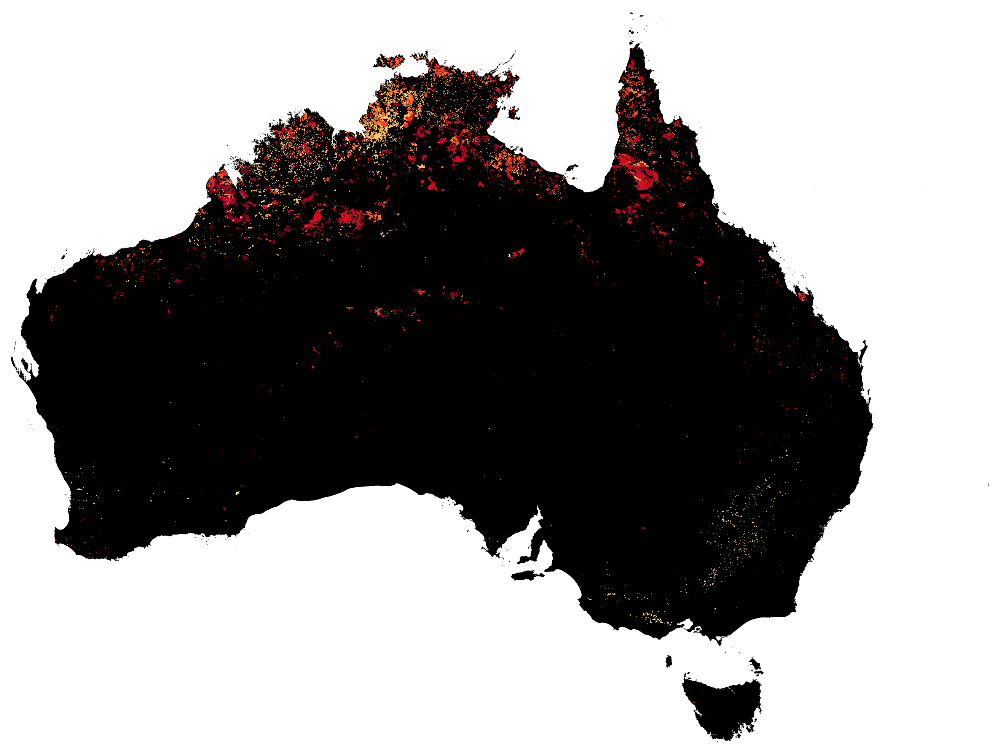
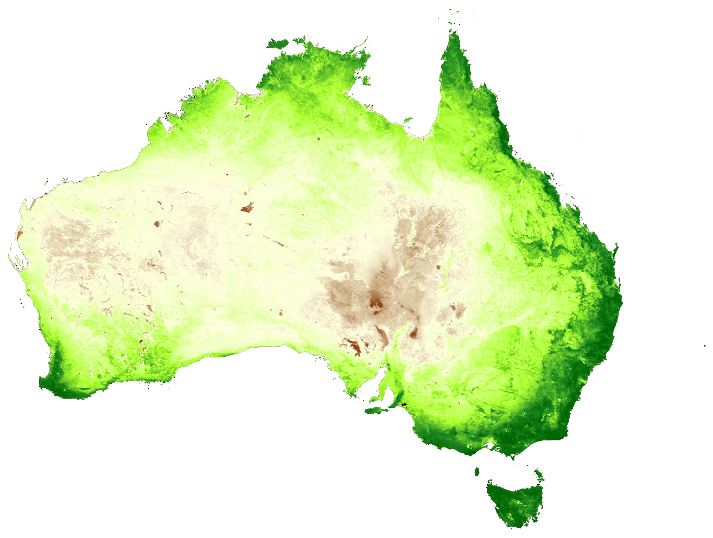
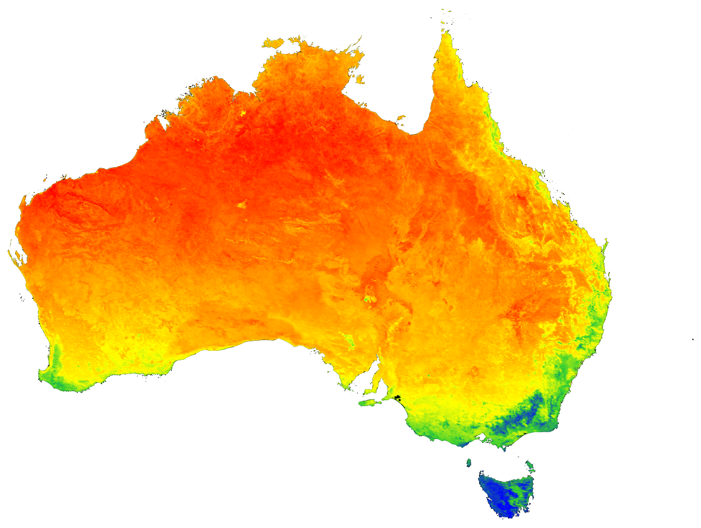
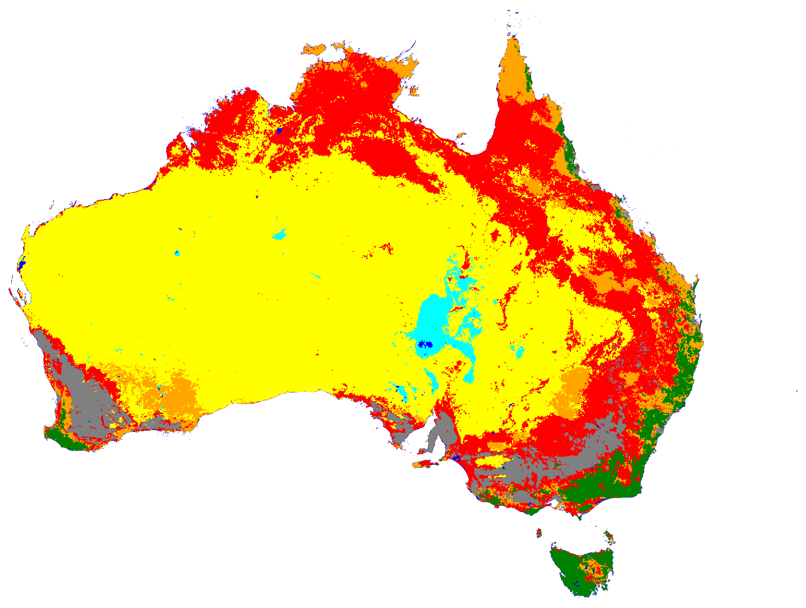
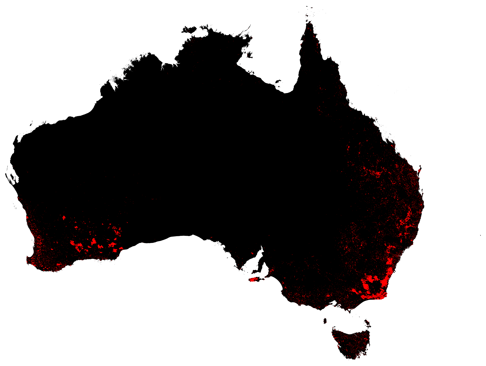
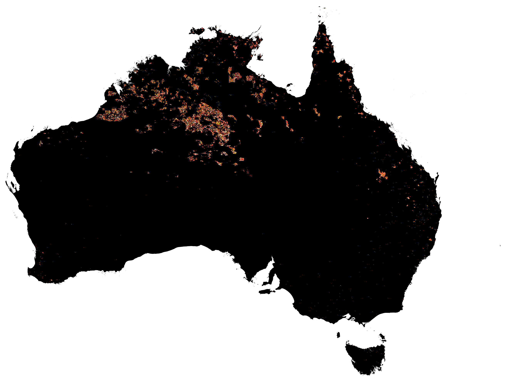

# 🛰️ Australia Environmental Monitoring

**A cloud-native geospatial pipeline and interactive WebGIS for tracking six key environmental signals across Australia using Google Earth Engine.**

[](https://earthengine.google.com)
[](https://vercel.com)
[](https://python.org)
[](https://leafletjs.com)
[](https://opensource.org/licenses/MIT)

[**🌐 Live WebGIS**](https://australia-env-monitoring.vercel.app) · [**📊 Outputs**](https://australia-env-monitoring.vercel.app/outputs.html) · [**📄 Report**](https://australia-env-monitoring.vercel.app/report.html)

</div>

---

## 📖 Overview

This project monitors six environmental signals across the Australian continent (7.7 million km²) using freely available satellite data processed entirely in the cloud on **Google Earth Engine**. It delivers:

- 🗺️ An **interactive WebGIS** with 7 toggleable layers
- 🖼️ Seven **high-resolution satellite maps** covering 2010–2023
- 🐍 A **reproducible Python pipeline** (Jupyter notebook + helper scripts)
- 📄 A **methodology report** with datasets, processing steps, and key findings

All layers are regenerated on demand from open data — no local storage of rasters required.

---

## 🗺️ Environmental Layers

| # | Layer | Icon | Dataset | Resolution | Period | Description |
|---|-------|:----:|---------|:----------:|:------:|-------------|
| 1 | **Burned Area** | 🔥 | MODIS `MCD64A1` | 500 m | 2021 | Annual maximum burn-date composite. Colours represent day-of-year the fire occurred. |
| 2 | **Fire Temperature Classes** | 🔥 | VIIRS `SNPP_VIIRS/C2` | 375 m | 8–30 Oct 2023 | Active-fire detections binned into 5 brightness-temperature classes (300–380+ K). |
| 3 | **Fire Detection Count** | 🔥 | VIIRS `SNPP_VIIRS/C2` | 375 m | 8–30 Oct 2023 | Per-pixel count of fire detections — reveals fire persistence. |
| 4 | **Land Surface Temperature** | 🌡️ | MODIS `MOD11A1` | 1 km | 2019 | Mean daytime LST in °C. Deserts exceed 45 °C seasonally. |
| 5 | **Land Cover** | 🌍 | MODIS `MCD12C1` | 500 m | 2022 | IGBP land cover remapped to 8 aggregated classes. |
| 6 | **NDVI Mean** | 🌿 | MODIS `MOD13A2` | 1 km | 2010–2021 | 12-year mean of the Normalized Difference Vegetation Index. |
| 7 | **Forest Loss** | 🌲 | Hansen GFC `v1.11` | 30 m | 2020–2022 | Stand-replacement forest loss, derived from Landsat. |

---

## 🚀 Live Demo

<div align="center">

### 🌐 [australia-env-monitoring.vercel.app](https://australia-env-monitoring.vercel.app)

</div>

| Page | URL | Description |
|------|-----|-------------|
| **Map** | `/` | Interactive Leaflet WebGIS with layer toggles + opacity sliders |
| **Outputs** | `/outputs.html` | Gallery of 7 static maps with lightbox zoom |
| **Report** | `/report.html` | One-page methodology + key findings |

---

## 🖼️ Layer Preview

<div align="center">

### 🔥 Burned Area 2021


### 🌿 NDVI Mean (2010–2021)


### 🌡️ Land Surface Temperature 2019


### 🌍 Land Cover 2022


### 🌲 Forest Loss 2020–2022


### 🔥 Fire Temperature Classes Oct 2023


</div>

---

## 🏗️ Project Structure

```
AUSTRALIA ENVIRONMENTAL MONITORING PROJECT/
│
├── AUSTRALIA ENVIRONMENTAL MONITORING.ipynb   # Main analysis notebook
│
├── exports_png/                                # High-res PNG exports (black bg)
│   ├── Burned_Area_2021.png
│   ├── Fire_Categories_2023.png
│   ├── Forest_Loss_2020_2022.png
│   ├── LST_Australia_2019.png
│   ├── LULC_Australia_2022.png
│   └── NDVI_Australia_Mean.png
│
├── scripts/                                    # Python utilities
│   ├── generate_tile_urls.py                  # Regenerate GEE tile URLs
│   ├── copy_pngs.py                           # Copy PNGs to webgis/images/
│   └── requirements.txt
│
├── webgis/                                     # Static WebGIS (deployed on Vercel)
│   ├── index.html                             # Map page
│   ├── outputs.html                           # Gallery page
│   ├── report.html                            # Report page
│   ├── styles.css                             # Shared stylesheet
│   ├── app.js                                 # Leaflet + tile logic
│   ├── data/
│   │   ├── tile_urls.json                     # GEE tile endpoints (auto-generated)
│   │   └── layer_metadata.json                # Layer configuration
│   └── images/                                # PNG copies for gallery
│
├── vercel.json                                 # Vercel deployment config
├── .gitignore
└── README.md
```

---

## 🛠️ Tech Stack

| Layer | Technology |
|-------|------------|
| **Data Processing** | Google Earth Engine (Python API) |
| **Analysis** | Jupyter, `geemap`, `earthengine-api` |
| **WebGIS** | Leaflet 1.9, vanilla JS, Google Fonts (Inter + Space Grotesk) |
| **Deployment** | Vercel (static site + rewrites) |
| **Data Sources** | NASA, USGS, University of Maryland (Hansen GFC) |

---

## 🚀 Local Development

### Prerequisites

- Python 3.10+
- A [Google Earth Engine](https://earthengine.google.com) account
- (Optional) [Vercel CLI](https://vercel.com/docs/cli) for deployment

### Setup

```bash
# 1. Clone the repository
git clone https://github.com/zafariabbas68/Australia-Environmental-Monitoring.git
cd Australia-Environmental-Monitoring

# 2. Create a virtual environment
python3 -m venv .venv
source .venv/bin/activate

# 3. Install dependencies
pip install -r scripts/requirements.txt

# 4. Authenticate with Earth Engine
earthengine authenticate
```

### Regenerate Tile URLs (every ~24 hours)

GEE tile URLs expire daily. Refresh them with:

```bash
# Option A — from the Jupyter notebook
jupyter notebook "AUSTRALIA ENVIRONMENTAL MONITORING.ipynb"
# Run the "Fetch Tile URLs" cell

# Option B — from the terminal (requires service account)
python scripts/generate_tile_urls.py
```

### Run the WebGIS Locally

```bash
cd webgis
python -m http.server 8000
# Open http://localhost:8000
```

---

## ☁️ Deploy on Vercel

### Method A — Dashboard

1. Fork or push this repo to GitHub
2. Go to [vercel.com/new](https://vercel.com/new)
3. Import the repository
4. **Framework Preset:** `Other`
5. **Build Command:** leave empty
6. **Output Directory:** leave empty
7. Click **Deploy**

### Method B — CLI

```bash
npm install -g vercel
vercel login
vercel --prod
```

---

## 📊 Key Findings

### 🔥 Fire Activity
> Over **90%** of VIIRS fire detections in October 2023 occurred in the tropical savannas of the Northern Territory and Queensland — a region that burns annually during the late dry season.

### 🌡️ Temperature
> Mean daytime LST in 2019 exceeded **45 °C** across the Great Victoria and Gibson deserts, while coastal Tasmania and Victoria averaged below **20 °C**.

### 🌿 Vegetation
> Mean NDVI for 2010–2021 exceeded **0.6** along the east coast and southwest forests, but stayed below **0.15** across the central arid zone.

### 🌲 Forest Loss
> Between 2020 and 2022, measurable forest loss occurred primarily in NSW and southeast Queensland — coinciding with the 2019–2020 bushfire recovery period and ongoing land-use change.

---

## 🔄 Data Sources

All data is open and freely available:

| Source | Product | Link |
|--------|---------|------|
| **NASA / USGS** | MODIS MCD64A1 (Burned Area) | [Catalog](https://developers.google.com/earth-engine/datasets/catalog/MODIS_061_MCD64A1) |
| **NASA** | VIIRS SNPP (Active Fires) | [Catalog](https://developers.google.com/earth-engine/datasets/catalog/NASA_LANCE_SNPP_VIIRS_C2) |
| **NASA / USGS** | MODIS MOD11A1 (Land Surface Temp) | [Catalog](https://developers.google.com/earth-engine/datasets/catalog/MODIS_061_MOD11A1) |
| **NASA / USGS** | MODIS MCD12C1 (Land Cover) | [Catalog](https://developers.google.com/earth-engine/datasets/catalog/MODIS_061_MCD12C1) |
| **NASA / USGS** | MODIS MOD13A2 (NDVI) | [Catalog](https://developers.google.com/earth-engine/datasets/catalog/MODIS_061_MOD13A2) |
| **UMD** | Hansen Global Forest Change v1.11 | [Catalog](https://developers.google.com/earth-engine/datasets/catalog/UMD_hansen_global_forest_change_2023_v1_11) |

---

## ⚠️ Notes

- **Tile URL expiry:** GEE tile endpoints expire after ~24 hours. Re-run `generate_tile_urls.py` to refresh and redeploy.
- **Service account:** The `service-account.json` file is `.gitignore`d — never commit it.
- **Rate limits:** GEE free tier is generous; the notebook processes ~30 images total.

---

## 🤝 Contributing

Contributions are welcome! Feel free to:

1. Fork the repo
2. Create a feature branch (`git checkout -b feature/new-layer`)
3. Commit your changes
4. Push and open a Pull Request

---

## 📜 License

This project is licensed under the **MIT License** — see the [LICENSE](LICENSE) file for details.

---

## 👤 Author

**Ghulam Abbas Zafari** · [Geolnzicht Platform](https://github.com/zafariabbas68)

Built with ☕ and satellite data.

---

<div align="center">

**⭐ If you find this project useful, consider giving it a star!**

Made with 🌏 using [Google Earth Engine](https://earthengine.google.com)

